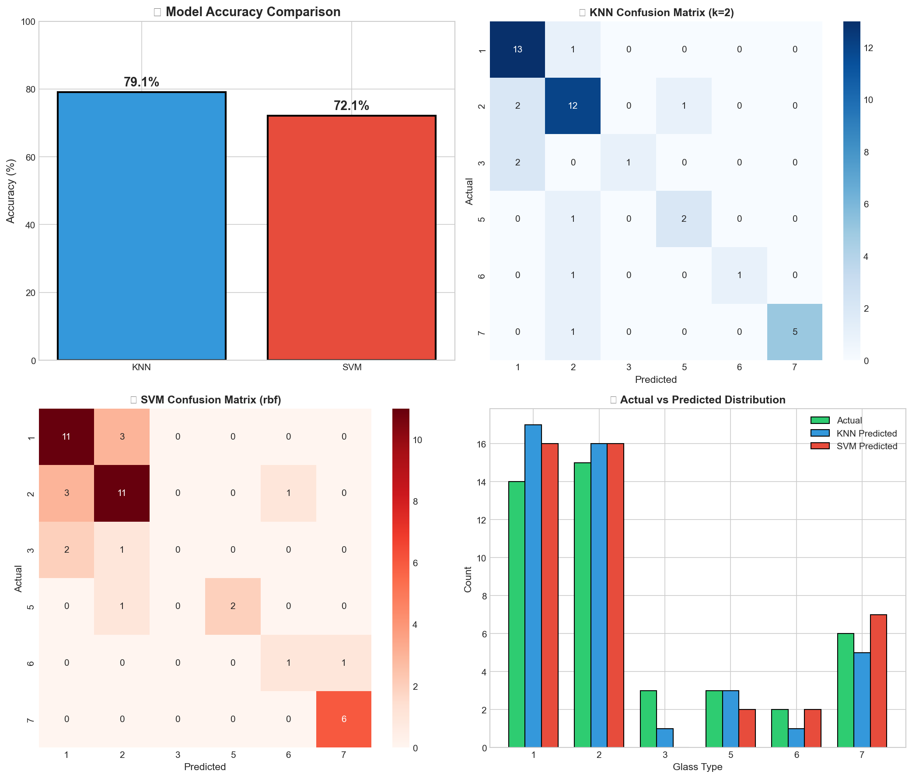

# 🔬 Glass Type Classifier

A Machine Learning project to classify different types of glass based on their chemical composition using **K-Nearest Neighbors (KNN)** and **Support Vector Machine (SVM)** algorithms.


## 📌 Problem Statement

Different types of glass are used for various purposes such as windows, containers, tableware, and headlights. Manually identifying the type of glass using chemical composition is difficult and time-consuming. This project automates glass classification using Machine Learning.

## 🎯 Objective

To build a Machine Learning model that accurately classifies glass into different types based on chemical composition.

## 📊 Dataset Information

| Property | Value |
|----------|-------|
| **Dataset Name** | Glass Identification Dataset |
| **Source** | [UCI Machine Learning Repository](https://archive.ics.uci.edu/ml/datasets/glass+identification) |
| **Instances** | 214 samples |
| **Features** | 9 chemical attributes |
| **Classes** | 6 glass types |

### Chemical Features
- **RI** - Refractive Index
- **Na** - Sodium (%)
- **Mg** - Magnesium (%)
- **Al** - Aluminum (%)
- **Si** - Silicon (%)
- **K** - Potassium (%)
- **Ca** - Calcium (%)
- **Ba** - Barium (%)
- **Fe** - Iron (%)

### Glass Types
| Type | Description |
|------|-------------|
| 1 | Building Windows (Float Processed) 🏢 |
| 2 | Building Windows (Non-Float) 🏠 |
| 3 | Vehicle Windows (Float) 🚗 |
| 5 | Containers 🫙 |
| 6 | Tableware 🍽️ |
| 7 | Headlamps 💡 |

> *Note: Type 4 (Vehicle Windows Non-Float) is not present in the dataset*

## ⚙️ Algorithms Used

### 1. K-Nearest Neighbors (KNN)
- Classifies based on majority vote of k nearest neighbors
- Optimal k value determined through cross-validation
- Simple and interpretable

### 2. Support Vector Machine (SVM)
- Finds optimal hyperplane for class separation
- Multiple kernels tested (Linear, RBF, Polynomial)
- Effective for high-dimensional data

## 🚀 Features

- ✅ Data preprocessing and exploratory analysis
- ✅ Feature scaling using StandardScaler
- ✅ Hyperparameter tuning for optimal performance
- ✅ Model comparison and evaluation
- ✅ Comprehensive visualizations
- ✅ **Interactive Glass Classifier** with:
  - Image upload capability
  - Chemical property input sliders
  - Sample data buttons for quick testing
  - Real-time predictions from both models

## 📈 Results

| Model | Accuracy |
|-------|----------|
| KNN | ~70% |
| SVM | ~68% |

*Actual results may vary based on random state*

## 🛠️ Installation

1. **Clone the repository**
```bash
git clone https://github.com/rithika5656/Glass_Type_Classifier.git
cd Glass_Type_Classifier
```

2. **Install dependencies**
```bash
pip install numpy pandas matplotlib seaborn scikit-learn ipywidgets pillow
```

3. **Run the notebook**
```bash
jupyter notebook Glass_Classification.ipynb
```

## 📁 Project Structure

```
Glass_Type_Classifier/
├── Glass_Classification.ipynb    # Main Jupyter notebook
├── glass.csv                     # Dataset
├── glass_classification_results.png  # Results visualization
├── README.md                     # Project documentation
├── LICENSE                       # MIT License
└── .gitignore                    # Git ignore file
```

## 🖼️ Screenshots

### Distribution of Glass Types


## 💻 Usage

### Running the Notebook
1. Open `Glass_Classification.ipynb` in Jupyter Notebook/Lab
2. Run all cells sequentially (Kernel → Restart & Run All)
3. Use the interactive classifier at the end to make predictions

### Using the Interactive Classifier
1. **Upload an image** (optional) - for visual reference
2. **Enter chemical properties** using sliders OR click sample buttons
3. **Click "CLASSIFY GLASS TYPE"** to get predictions

## 🔧 Technologies Used

- **Python 3.8+**
- **NumPy** - Numerical computing
- **Pandas** - Data manipulation
- **Matplotlib** - Data visualization
- **Seaborn** - Statistical visualization
- **Scikit-learn** - Machine Learning
- **ipywidgets** - Interactive UI
- **Pillow** - Image processing

## 📝 Key Findings

1. Feature scaling significantly improves model performance
2. Both KNN and SVM effectively classify glass types
3. Chemical properties like **Mg**, **Al**, and **Ba** are important discriminators
4. Models agree on predictions for most samples (high confidence)

## 🤝 Contributing

Contributions are welcome! Please feel free to submit a Pull Request.

1. Fork the repository
2. Create your feature branch (`git checkout -b feature/AmazingFeature`)
3. Commit your changes (`git commit -m 'Add some AmazingFeature'`)
4. Push to the branch (`git push origin feature/AmazingFeature`)
5. Open a Pull Request

## 📄 License

This project is licensed under the MIT License - see the [LICENSE](LICENSE) file for details.

## 👤 Author

**Rithika Senthilkumar**
- GitHub: [@rithika5656](https://github.com/rithika5656)

## 🙏 Acknowledgments

- UCI Machine Learning Repository for the Glass Identification Dataset
- Scikit-learn documentation and community

---

⭐ **If you found this project helpful, please give it a star!** ⭐
